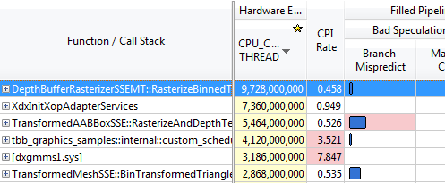
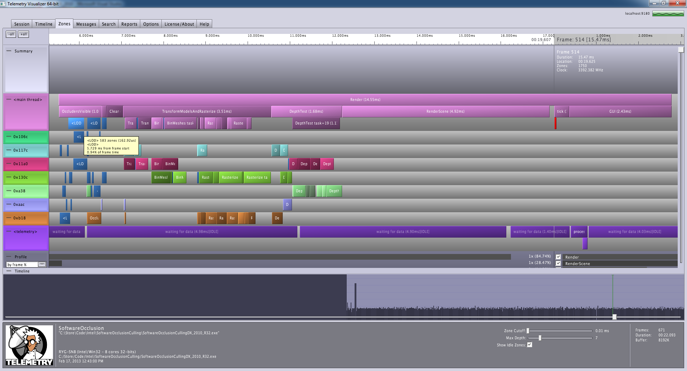
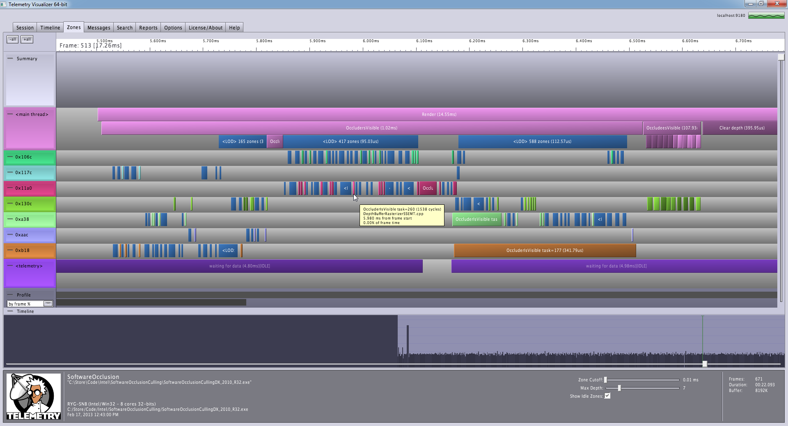
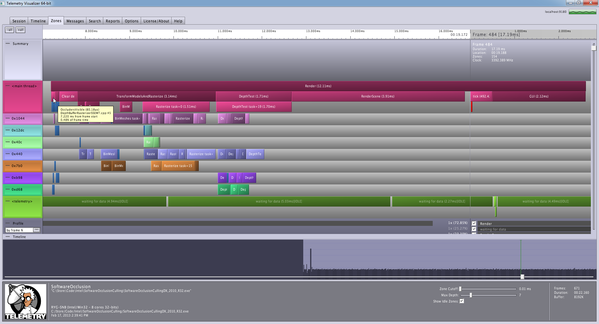
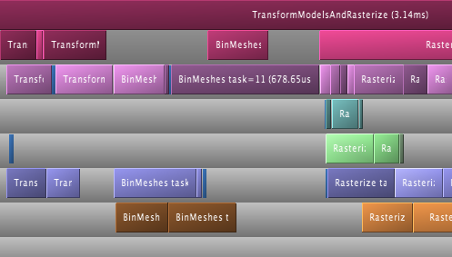
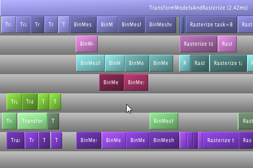
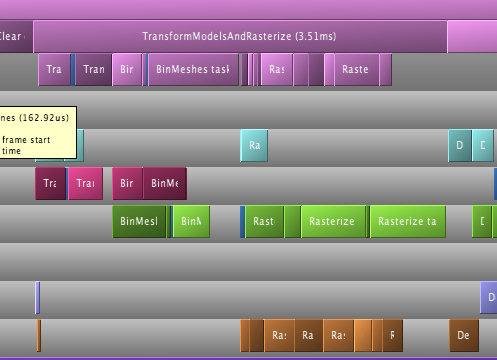
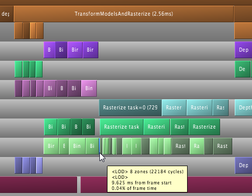

The care and feeding of worker threads, part 1
##############################################
:date: 2013-02-17 23:31
:author: Fgiesen
:category: Coding

*This post is part of a series - go :doc:`here <index>` for the index.*

It's time for another post! After all the time I've spent on squeezing
about 20% out of the depth rasterizer, I figured it was time to change
gears and look at something different again. But before we get started
on that new topic, there's one more set of changes that I want to talk
about.

The occlusion test rasterizer
~~~~~~~~~~~~~~~~~~~~~~~~~~~~~

So far, we've mostly been looking at one rasterizer only - the one that
actually renders the depth buffer we cull against, and even more
precisely, only multi-threaded SSE version of it. But the occlusion
culling demo has two sets of rasterizers: the other set is used for the
occlusion tests. It renders bounding boxes for the various models to be
tested and checks whether they are fully occluded. Check out the `code`_
if you're interested in the details.

This is basically the same rasterizer that we already talked about. In
the previous two posts, I talked about optimizing the depth buffer
rasterizer, but most of the same changes apply to the test rasterizer
too. It didn't make sense to talk through the same thing again, so I
took the liberty of just making the same changes (with some minor
tweaks) to the test rasterizer "off-screen". So, just a heads-up: the
test rasterizer has changed while you weren't looking - unless you
closely watch the Github repository, that is.

And now that we've established that there's another inner loop we ought
to be aware of, let's zoom out a bit and look at the bigger picture.

Some open questions
~~~~~~~~~~~~~~~~~~~

There's two questions you might have if you've been following this
series closely so far. The first concerns a very visible difference
between the depth and test rasterizers that you might have noticed if
you ran the code. It's also visible in the data in :doc:`depth-buffers-done-quick-part-1`,
though I didn't talk about it at the time. I'm
talking, of course, about the large standard deviation we get for the
execution time of the occlusion tests. Here's a set of measurements for
the code right after bringing the test rasterizer up to date:

.. raw:: html

   <table>

.. raw:: html

   <tr>

.. raw:: html

   <th>

Pass

.. raw:: html

   </th>

.. raw:: html

   <th>

min

.. raw:: html

   </th>

.. raw:: html

   <th>

25th

.. raw:: html

   </th>

.. raw:: html

   <th>

med

.. raw:: html

   </th>

.. raw:: html

   <th>

75th

.. raw:: html

   </th>

.. raw:: html

   <th>

max

.. raw:: html

   </th>

.. raw:: html

   <th>

mean

.. raw:: html

   </th>

.. raw:: html

   <th>

sdev

.. raw:: html

   </th>

.. raw:: html

   </tr>

.. raw:: html

   <tr>

.. raw:: html

   <td>

Render depth

.. raw:: html

   </td>

.. raw:: html

   <td>

2.666

.. raw:: html

   </td>

.. raw:: html

   <td>

2.716

.. raw:: html

   </td>

.. raw:: html

   <td>

2.732

.. raw:: html

   </td>

.. raw:: html

   <td>

2.745

.. raw:: html

   </td>

.. raw:: html

   <td>

2.811

.. raw:: html

   </td>

.. raw:: html

   <td>

2.731

.. raw:: html

   </td>

.. raw:: html

   <td>

0.022

.. raw:: html

   </td>

.. raw:: html

   </tr>

.. raw:: html

   <tr>

.. raw:: html

   <td>

Occlusion test

.. raw:: html

   </td>

.. raw:: html

   <td>

1.335

.. raw:: html

   </td>

.. raw:: html

   <td>

1.545

.. raw:: html

   </td>

.. raw:: html

   <td>

1.587

.. raw:: html

   </td>

.. raw:: html

   <td>

1.631

.. raw:: html

   </td>

.. raw:: html

   <td>

1.761

.. raw:: html

   </td>

.. raw:: html

   <td>

1.585

.. raw:: html

   </td>

.. raw:: html

   <td>

0.066

.. raw:: html

   </td>

.. raw:: html

   </tr>

.. raw:: html

   </table>

Now, the standard deviation actually got a fair bit lower with the
rasterizer changes (originally, we were well above 0.1ms), but it's
still surprisingly large, especially considering that the occlusion
tests run roughly half as long (in terms of wall-clock time) as the
depth rendering. And there's also a second elephant in the room that's
been staring us in the face for quite a while. Let me recycle one of the
VTune screenshots from last time:

|Rasterizer hotspots without early-out|

Right there at #4 is some code from `TBB`_, namely, what turns out to be
the "thread is idle" spin loop.

Well, so far, we've been profiling, measuring and optimizing this as if
it was a single-threaded application, but it's not. The code uses TBB to
dispatch tasks to worker threads, and clearly, a lot of these worker
threads seem to be idle a lot of the time. But why? To answer that
question, we need a bit different information than what either a normal
VTune analysis run or our summary timers give us. We want a detailed
breakdown of what happens during a frame. Now, VTune has *some* support
for that (as part of their threading/concurrency profiling), but the UI
doesn't work well for me, and neither does the the visualization; it
seems to be geared towards HPC/throughput computing more than
latency-sensitive applications like real-time graphics, and it's also
still based on sampling profiling, which means it's low-overhead but
fairly limited in the kind of data it can collect.

Instead, I'm going to go for the shameless plug and use `Telemetry`_
instead (full disclosure: I work at RAD). It works like this: I manually
instrument the source code to tell Telemetry when certain events are
happening, and Telemetry collects that data, sends the whole log to a
server and can later visualize it. Most games I've worked on have some
kind of "bar graph profiler" that can visualize within-frame events, but
because Telemetry keeps the whole data stream, it can also be used to
answer the favorite question (not!) of engine programmers everywhere:
"Wait, what the hell just happened there?". Instead of trying to explain
it in words, I'm just gonna show you the screenshot of my initial
profiling run after I hooked up Telemetry and added some basic markup:
(Click on the image to get the full-sized version)

|Initial Telemetry run|

The time axis goes from left to right, and all of the blocks correspond
to regions of code that I've marked up. Regions can nest, and when they
do, the blocks stack. I'm only using really basic markup right now,
because that turns out to be all we need for the time being. The
different tracks correspond to different threads.

As you can see, despite the code using TBB and worker threads, it's
fairly rare for more than 2 threads to be actually running anything
interesting at a time. Also, if you look at the "Rasterize" and
"DepthTest" tasks, you'll notice that we're spending a fair amount of
time just waiting for the last 2 threads to finish their respective
jobs, while the other worker threads are idle. That's where our variance
in latency ultimately comes from - it all depends on how lucky (or
unlucky) we get with scheduling, and the exact scheduling of tasks
changes every frame. And now that we've seen how much time the worker
threads spend being idle, it also shouldn't surprise us that TBB's idle
spin loop ranked as high as it did in the profile.

What do we do about it, though?

Let's start with something simple
~~~~~~~~~~~~~~~~~~~~~~~~~~~~~~~~~

As usual, we go for the low-hanging fruit first, and if you look at the
left side of the screenshot I'll posted, you'll see *a lot* of blocks
("zones") on the left side of the screen. In fact, the count is much
higher than you probably think - these are LOD zones, which means that
Telemetry has grouped a bunch of very short zones into larger groups for
the purposes of visualization. As you can see from the mouse-over text,
the single block I'm pointing at with the mouse cursor corresponds to
583 zones - and each of those zones corresponds to an individual TBB
task! That's because this culling code uses one TBB task per model to be
culled. *Ouch.* Let's zoom in a bit:

|Telemetry: occluder visibility, zoomed|

Note that even at this zoom level (the whole screen covers about 1.3ms),
most zones are *still* LOD'd out. I've mouse-over'ed on a single task
that happens to hit one or two L3 cache miss and so is long enough (at
about 1500 cycles) to show up individually, but most of these tasks are
closer to 600 cycles. In total, frustum culling the approximately 1600
occluder models takes up just above 1ms, as the captions helpfully say.
For reference, the much smaller block that says "OccludeesVisible" and
takes about 0.1ms? That one actually processes about 27000 models (it's
the code we optimized in :doc:`frustum-culling-turning-the-crank`).
Again, *ouch*.

Fortunately, there's a simple solution: don't use one task per model.
Instead, use a smaller number of tasks (I just used 32) that each cover
multiple models. The code is fairly obvious, so I won't bother repeating
it here, but I am going to show you the results:

|Telemetry: Occluder culling fixed|

Down from 1ms to 0.08ms in two minutes of work. Now we could apply the
same level of optimization as we did to the occludee culling, but I'm
not going to bother, because at least not for the time being it's fast
enough. And with that out of the way, let's look at the rasterization
and depth testing part.

A closer look
~~~~~~~~~~~~~

Let's look a bit more closely at what's going on during rasterization:

|Rasterization close-up|

There are at least two noteworthy things clearly visible in this
screenshot:

#. There's three separate passes - transform, bin, then rasterize.
#. For some reason, we seem to have an odd mixture of really long tasks
   and very short ones.

The former shouldn't come as a surprise, since it's explicit in the
code:

::

    gTaskMgr.CreateTaskSet(&DepthBufferRasterizerSSEMT::TransformMeshes, this,    NUM_XFORMVERTS_TASKS, NULL, 0, "Xform Vertices", &mXformMesh);gTaskMgr.CreateTaskSet(&DepthBufferRasterizerSSEMT::BinTransformedMeshes, this,    NUM_XFORMVERTS_TASKS, &mXformMesh, 1, "Bin Meshes", &mBinMesh);gTaskMgr.CreateTaskSet(&DepthBufferRasterizerSSEMT::RasterizeBinnedTrianglesToDepthBuffer, this,    NUM_TILES, &mBinMesh, 1, "Raster Tris to DB", &mRasterize);    // Wait for the task setgTaskMgr.WaitForSet(mRasterize);

What the screenshot does show us, however, is the cost of those
synchronization points. There sure is a lot of "air" in that diagram,
and we could get some significant gains from squeezing it out. The
second point is more of a surprise though, because the code does in fact
try pretty hard to make sure the tasks are evenly sized. There's a
problem, though:

::

    void TransformedModelSSE::TransformMeshes(...){    if(mVisible)    {        // compute mTooSmall        if(!mTooSmall)        {            // transform verts        }    }}void TransformedModelSSE::BinTransformedTrianglesMT(...){    if(mVisible && !mTooSmall)    {        // bin triangles    }}

Just because we make sure each task handles an equal number of vertices
(as happens for the "TransformMeshes" tasks) or an equal number of
triangles ("BinTransformedTriangles") doesn't mean they are
similarly-sized, because the work subdivision ignores culling.
Evidently, the tasks end up *not* being uniformly sized - not even
close. Looks like we need to do some load balancing.

Balancing act
~~~~~~~~~~~~~

To simplify things, I moved the computation of ``mTooSmall`` from
``TransformMeshes`` into ``IsVisible`` - right after the frustum culling
itself. That required some shuffling arguments around, but it's exactly
the kind of thing we already saw in :doc:`frustum-culling-turning-the-crank`,
so there's little point in going over it in detail again.

Once ``TransformMeshes`` and ``BinTransformedTrianglesMT`` use the exact
same condition - ``mVisible && !mTooSmall`` - we can determine the list
of models that are visible and not too small once, compute how many
triangles and vertices these models have in total, and then use these
corrected numbers which account for the culling when we're setting up
the individual transform and binning tasks.

This is easy to do: ``DepthBufferRasterizerSSE`` gets a few more member
variables

::

    UINT *mpModelIndexA; // 'active' models = visible and not too smallUINT mNumModelsA;UINT mNumVerticesA;UINT mNumTrianglesA;

and two new member functions

::

    inline void ResetActive(){    mNumModelsA = mNumVerticesA = mNumTrianglesA = 0;}inline void Activate(UINT modelId){    UINT activeId = mNumModelsA++;    assert(activeId < mNumModels1);    mpModelIndexA[activeId] = modelId;    mNumVerticesA += mpStartV1[modelId + 1] - mpStartV1[modelId];    mNumTrianglesA += mpStartT1[modelId + 1] - mpStartT1[modelId];}

that handle the accounting. The depth buffer rasterizer already kept
cumulative vertex and triangle counts for all models; I added one more
element at the end so I could use the simplified
vertex/triangle-counting logic.

Then, at the end of the ``IsVisible`` pass (after the worker threads are
done), I run

::

    // Determine which models are activeResetActive();for (UINT i=0; i < mNumModels1; i++)    if(mpTransformedModels1[i].IsRasterized2DB())        Activate(i);

where ``IsRasterized2DB()`` is just a predicate that returns
``mIsVisible && !mTooSmall`` (it was already there, so I used it).

After that, all that remains is distributing work over the active models
only, using ``mNumVerticesA`` and ``mNumTrianglesA``. This is as simple
as turning the original loop in ``TransformMeshes``

::

    for(UINT ss = 0; ss < mNumModels1; ss++)

into

::

    for(UINT active = 0; active < mNumModelsA; active++){    UINT ss = mpModelIndexA[active];    // ...}

and the same for ``BinTransformedMeshes``. All in all, this took me
about 10 minutes to write, debug and test. And with that, we should have
proper load balancing for the first two passes of rendering: transform
and binning. The question, as always, is: does it help?

**Change**: Better rendering "front end" load balancing

.. raw:: html

   <table>

.. raw:: html

   <tr>

.. raw:: html

   <th>

Version

.. raw:: html

   </th>

.. raw:: html

   <th>

min

.. raw:: html

   </th>

.. raw:: html

   <th>

25th

.. raw:: html

   </th>

.. raw:: html

   <th>

med

.. raw:: html

   </th>

.. raw:: html

   <th>

75th

.. raw:: html

   </th>

.. raw:: html

   <th>

max

.. raw:: html

   </th>

.. raw:: html

   <th>

mean

.. raw:: html

   </th>

.. raw:: html

   <th>

sdev

.. raw:: html

   </th>

.. raw:: html

   </tr>

.. raw:: html

   <tr>

.. raw:: html

   <td>

Initial depth render

.. raw:: html

   </td>

.. raw:: html

   <td>

2.666

.. raw:: html

   </td>

.. raw:: html

   <td>

2.716

.. raw:: html

   </td>

.. raw:: html

   <td>

2.732

.. raw:: html

   </td>

.. raw:: html

   <td>

2.745

.. raw:: html

   </td>

.. raw:: html

   <td>

2.811

.. raw:: html

   </td>

.. raw:: html

   <td>

2.731

.. raw:: html

   </td>

.. raw:: html

   <td>

0.022

.. raw:: html

   </td>

.. raw:: html

   </tr>

.. raw:: html

   <tr>

.. raw:: html

   <td>

Balance front end

.. raw:: html

   </td>

.. raw:: html

   <td>

2.282

.. raw:: html

   </td>

.. raw:: html

   <td>

2.323

.. raw:: html

   </td>

.. raw:: html

   <td>

2.339

.. raw:: html

   </td>

.. raw:: html

   <td>

2.362

.. raw:: html

   </td>

.. raw:: html

   <td>

2.476

.. raw:: html

   </td>

.. raw:: html

   <td>

2.347

.. raw:: html

   </td>

.. raw:: html

   <td>

0.034

.. raw:: html

   </td>

.. raw:: html

   </tr>

.. raw:: html

   </table>

Oh boy, does it ever. That's a 14.4% reduction *on top of what we
already got last time*. And Telemetry tells us we're now doing a much
better job at submitting uniform-sized tasks:

|Balanced rasterization front end|

In this frame, there's still one transform batch that takes longer than
the others; this happens sometimes, because of context switches for
example. But note that the other threads nicely pick up the slack, and
we're still fine: a ~2x variation on the occasional item isn't a big
deal, provided most items are still roughly the same size. Also note
that, even though there's 8 worker threads, we never seem to be running
more than 4 tasks at a time, and the hand-offs between threads (look at
what happens in the BinMeshes phase) seem too perfectly synchronized to
just happen accidentally. I'm assuming that TBB intentionally never uses
more than 4 threads because the machine I'm running this on has a
quad-core CPU (albeit with HyperThreading), but I haven't checked
whether this is just a configuration option or not; it probably is.

Balancing the rasterizer back end
~~~~~~~~~~~~~~~~~~~~~~~~~~~~~~~~~

Now we can't do the same trick for the actual triangle rasterization,
because it works in tiles, and they just end up with uneven amounts of
work depending on what's on the screen - there's nothing we can do about
that. That said, we're definitely hurt by the uneven task sizes here too
- for example, on my original Telemetry screenshot, you can clearly see
how the non-uniform job sizes hurt us:

|Initial bad rasterizer balance|

The green thread picks up a tile with lots of triangles to render pretty
late, and as a result everyone else ends up waiting for him to finish.
This is not good.

However, lucky for us, there's a solution: the TBB task manager will
parcel out tasks roughly in the order they were submitted. So all we
have to do is to make sure the "big" tiles come first. Well, after
binning is done, we know exactly how many triangles end up in each tile.
So what we do is insert a single task between

binning and rasterization that determines the right order to process the
tiles in, then make the actual rasterization depend on it:

::

    gTaskMgr.CreateTaskSet(&DepthBufferRasterizerSSEMT::BinSort, this,    1, &mBinMesh, 1, "BinSort", &sortBins);gTaskMgr.CreateTaskSet(&DepthBufferRasterizerSSEMT::RasterizeBinnedTrianglesToDepthBuffer,    this, NUM_TILES, &sortBins, 1, "Raster Tris to DB", &mRasterize);   

So how does that function look? Well, all we have to do is count how
many triangles ended up in each triangle, and then sort the tiles by
that. The function is so short I'm just gonna show you the whole thing:

::

    void DepthBufferRasterizerSSEMT::BinSort(VOID* taskData,    INT context, UINT taskId, UINT taskCount){    DepthBufferRasterizerSSEMT* me =        (DepthBufferRasterizerSSEMT*)taskData;    // Initialize sequence in identity order and compute total    // number of triangles in the bins for each tile    UINT tileTotalTris[NUM_TILES];    for(UINT tile = 0; tile < NUM_TILES; tile++)    {        me->mTileSequence[tile] = tile;        UINT base = tile * NUM_XFORMVERTS_TASKS;        UINT numTris = 0;        for (UINT bin = 0; bin < NUM_XFORMVERTS_TASKS; bin++)            numTris += me->mpNumTrisInBin[base + bin];        tileTotalTris[tile] = numTris;    }    // Sort tiles by number of triangles, decreasing.    std::sort(me->mTileSequence, me->mTileSequence + NUM_TILES,        [&](const UINT a, const UINT b)        {            return tileTotalTris[a] > tileTotalTris[b];         });}

where ``mTileSequence`` is just an array of ``UINT``\ s with
``NUM_TILES`` elements. Then we just rename the ``taskId`` parameter of
``RasterizeBinnedTrianglesToDepthBuffer`` to ``rawTaskId`` and start the
function like this:

::

        UINT taskId = mTileSequence[rawTaskId];

and presto, we have bin sorting. Here's the results:

**Change**: Sort back-end tiles by amount of work

.. raw:: html

   <table>

.. raw:: html

   <tr>

.. raw:: html

   <th>

Version

.. raw:: html

   </th>

.. raw:: html

   <th>

min

.. raw:: html

   </th>

.. raw:: html

   <th>

25th

.. raw:: html

   </th>

.. raw:: html

   <th>

med

.. raw:: html

   </th>

.. raw:: html

   <th>

75th

.. raw:: html

   </th>

.. raw:: html

   <th>

max

.. raw:: html

   </th>

.. raw:: html

   <th>

mean

.. raw:: html

   </th>

.. raw:: html

   <th>

sdev

.. raw:: html

   </th>

.. raw:: html

   </tr>

.. raw:: html

   <tr>

.. raw:: html

   <td>

Initial depth render

.. raw:: html

   </td>

.. raw:: html

   <td>

2.666

.. raw:: html

   </td>

.. raw:: html

   <td>

2.716

.. raw:: html

   </td>

.. raw:: html

   <td>

2.732

.. raw:: html

   </td>

.. raw:: html

   <td>

2.745

.. raw:: html

   </td>

.. raw:: html

   <td>

2.811

.. raw:: html

   </td>

.. raw:: html

   <td>

2.731

.. raw:: html

   </td>

.. raw:: html

   <td>

0.022

.. raw:: html

   </td>

.. raw:: html

   </tr>

.. raw:: html

   <tr>

.. raw:: html

   <td>

Balance front end

.. raw:: html

   </td>

.. raw:: html

   <td>

2.282

.. raw:: html

   </td>

.. raw:: html

   <td>

2.323

.. raw:: html

   </td>

.. raw:: html

   <td>

2.339

.. raw:: html

   </td>

.. raw:: html

   <td>

2.362

.. raw:: html

   </td>

.. raw:: html

   <td>

2.476

.. raw:: html

   </td>

.. raw:: html

   <td>

2.347

.. raw:: html

   </td>

.. raw:: html

   <td>

0.034

.. raw:: html

   </td>

.. raw:: html

   </tr>

.. raw:: html

   <tr>

.. raw:: html

   <td>

Balance back end

.. raw:: html

   </td>

.. raw:: html

   <td>

2.128

.. raw:: html

   </td>

.. raw:: html

   <td>

2.162

.. raw:: html

   </td>

.. raw:: html

   <td>

2.178

.. raw:: html

   </td>

.. raw:: html

   <td>

2.201

.. raw:: html

   </td>

.. raw:: html

   <td>

2.284

.. raw:: html

   </td>

.. raw:: html

   <td>

2.183

.. raw:: html

   </td>

.. raw:: html

   <td>

0.029

.. raw:: html

   </td>

.. raw:: html

   </tr>

.. raw:: html

   </table>

Once again, we're 20% down from where we started! Now let's check in
Telemetry to make sure it worked correctly and we weren't just lucky:

|Rasterizer fully balanced|

Now that's just *beautiful*. See how the whole thing is now densely
packed into the live threads, with almost no wasted space? This is how
you want your profiles to look. Aside from the fact that our
rasterization only seems to be running on 3 threads, that is - there's
always more digging to do. One fun thing I noticed is that TBB actually
doesn't process the tasks fully in-order; the two top threads indeed
start from the biggest tiles and work their way forwards, but the
bottom-most thread actually starts from the end of the queue, working
its way towards the beginning. The tiny LOD zone I'm hovering over
covers both the bin sorting task and the seven smallest tiles; the
packets get bigger from there.

And with that, I think we have enough changes (and images!) for one
post. We'll continue ironing out scheduling kinks next time, but I think
the lesson is already clear: you can't just toss tasks to worker threads
and expect things to go smoothly. If you want to get good thread
utilization, better profile to make sure your threads actually do what
you think they're doing! And as usual, you can find the code for this
post on `Github`_, albeit without the Telemetry instrumentation for now
- Telemetry is a commercial product, and I don't want to introduce any
dependencies that make it harder for people to compile the code. Take
care, and until next time.

.. _code: https://github.com/rygorous/intel_occlusion_cull/blob/4c64fd75/SoftwareOcclusionCulling/TransformedAABBoxSSE.cpp#L165
.. _TBB: http://threadingbuildingblocks.org/
.. _Telemetry: http://www.radgametools.com/telemetry.htm
.. _Github: https://github.com/rygorous/intel_occlusion_cull/tree/blog

