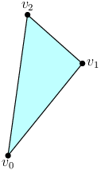
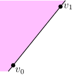
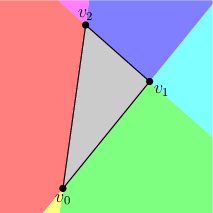
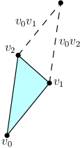
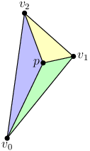
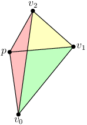

The barycentric conspiracy
##########################
:date: 2013-02-06 03:16
:author: Fgiesen
:category: Maths

*This post is part of a series - go `here`_ for the index.*

And welcome back to my impromptu optimization series. Today, we won't
see a single line of code, nor a profiler screenshot. That's because our
next subject is the triangle rasterizer, and we better brush up on our
triangle facts before we dive into that. A lot of it is going to involve
barycentric coordinates, hence the name. Be warned, this post is a lot
drier than the previous ones, and it doesn't even have a big pay-off at
the end. It's a pure, uncut info-dump. The purpose is to collect all
this material in one place so I can refer back to it later as necessary.

Meet the triangle
~~~~~~~~~~~~~~~~~

.. raw:: html

   

Let's just start by fast-forwarding through a whole bunch of things I
assume you already know. If you don't, Wikipedia can help you, as can
virtually any maths textbook that covers planar geometry.

|A triangle.|

A *triangle* is a polygon with 3 vertices v\ :sub:`0`, v\ :sub:`1`,
v\ :sub:`2` and 3 edges v\ :sub:`0`\ v\ :sub:`1`,
v\ :sub:`1`\ v\ :sub:`2`, v\ :sub:`2`\ v\ :sub:`0`. You can see a fine
specimen on the left. A *degenerate* triangle is one where the three
vertices are collinear, i.e. they all fall on the same line (or they
might even be all the same point). Any triangle lies on a plane, and for
all non-degenerate triangles, that plane is uniquely determined. This
holds in any dimension, but is somewhat vacuous in 0D or 1D where any 3
vertices are going to be collinear.

Restricting ourselves to 2D for the moment, a triangle, `like any
non-self-intersecting planar polygon`_, divides the plane into two
regions: the *interior*, which is finite, and the *exterior*, which is
not. The two are separated by the *boundary* of the triangles, which
consists of the three edges. To *rasterize* a triangle, we essentially
just need to query a bunch of points, usually directly corresponding to
the pixel grid or arranged in some other regular pattern, and figure out
whether they are inside or not. Since this is a binary result and our
query provides a ternary answer (outside, on the boundary, inside), we
need to define how points on the boundary are to be handled. There's
multiple ways to do this; I'll cover them in the article about actual
triangle rasterization. Since a triangle is always planar, it's easy to
extend these definitions to higher dimensions by always working in the
plane of the triangle (or in *a* plane of the triangle, should it be
degenerate).

Finally, triangles are always *convex*: for any two points inside the
triangle, the line connecting them is also fully inside the triangle.
Convexity turns out to be important: in the plane, the inside of a
convex polygon with n edges can always be written as the intersection of
n half-spaces. That fact in itself is enough to write a triangle
rasterizer, but if you haven't done this before, you might be wondering
what the hell I'm talking about at this point. So let's take a step back
and talk about the geometry of the situation for a second.

Oriented edges
~~~~~~~~~~~~~~

.. raw:: html

   

|Positive half-space of v0v1| Consider, for a moment, the edge
v\ :sub:`0`\ v\ :sub:`1` in the image above. The edge itself is a line
segment. The corresponding line divides the plane into two halves (the
half-spaces I mentioned): a "left" side and a "right" side. This is
shown in the image on the left, with the "left" side being shaded. Now,
speaking of it in those terms gets problematic if the edge we picked
happens to be horizontal (which of the two halves is the "left" one if
they're stacked vertically?). So instead, we're going to phrase
everything relative to the edge rather than the picture we're drawing:
imagine you're walking down the edge from v\ :sub:`0` towards
v\ :sub:`1`. Then, we're gonna refer to everything on your left side (if
you're looking towards v\ :sub:`1`) as the "positive" half-space, and
everything to the right as the "negative" half-space. Finally, points
that are either right in front of you or right behind you (that is,
points that fall on the line) belong to neither half-space.

Now, if we apply the same construction to the other two edges and
overlay it all on top of each other, we get this image:

|Three half-spaces at once|

Walking through all its technicolored glory (apologies to the
color-blind):

-  The green region is in the positive half-space (I'm just gonna write
   "inside") of v\ :sub:`1`\ v\ :sub:`2` and v\ :sub:`2`\ v\ :sub:`0`,
   but outside of v\ :sub:`0`\ v\ :sub:`1`.
-  The cyan region is inside v\ :sub:`2`\ v\ :sub:`0`, but outside the
   two other edges.
-  Blue is inside v\ :sub:`0`\ v\ :sub:`1` and v\ :sub:`2`\ v\ :sub:`0`.
-  Magenta is inside v\ :sub:`0`\ v\ :sub:`1` - all that's left of the
   region we saw above.
-  Red is inside v\ :sub:`0`\ v\ :sub:`1` and v\ :sub:`1`\ v\ :sub:`2`.
-  Yellow is inside v\ :sub:`1`\ v\ :sub:`2`.
-  Finally, the gray region is inside all three edges - and that's
   exactly our triangle.

.. raw:: html

   

And so we have the picture to go with my "intersection of 3 half-spaces"
comment earlier. This means that all we need to figure out whether a
point is in a triangle is to figure out whether it's in all three
positive half-spaces, which turns out to be fairly easy. That is,
assuming that such a point even exists - what would've happened if
v\ :sub:`2` had been to the right of v\ :sub:`0`\ v\ :sub:`1` instead of
to the left, or if the same thing happened with any of the other edges?
We'll get there in a minute, but let's first go into how we figure out
whether a point is in the positive half-space or not.

Area, length, orientation
~~~~~~~~~~~~~~~~~~~~~~~~~

.. raw:: html

   

If we have the coordinates of all involved points, the answer turns out
to be: determinants. And not just any old determinant will do; given the
three points a, b and c, we want to compute the determinant

$latex \\mathrm{Orient2D}(a,b,c) = \\begin{vmatrix} a\_x & b\_x & c\_x
\\\\ a\_y & b\_y & c\_y \\\\ 1 & 1 & 1 \\end{vmatrix} = \\begin{vmatrix}
b\_x - a\_x & c\_x - a\_x \\\\ b\_y - a\_y & c\_y - a\_y \\end{vmatrix}$

Clearly, if this expression is positive, c lies to the left of the
directed edge ab (i.e. the triangle abc is wound counter-clockwise), and
with that out of the way, we can start rasterizing triangles...

Wait, *what*?

Sorry, pet peeve. A lot of texts like to just spring these expressions
on you without much explanation. That's fine for papers, where you can
expect your audience to know this already, but even a lot of
introductory texts don't bother with an actual explanation, which annoys
me, because while this isn't hard, it's by no means obvious either.

So let's look at this beast a bit more closely. First, notice how the
first expression simply puts the three vertices into the columns with an
appended 1 - why yes, those are in fact homogeneous coordinates, thank
you for noticing. We're not gonna make use of that here, but it's worth
knowing. Second, because we just use the vertex coordinates as the
columns, this should make it immediately obvious that this expression is
the same for all possible orderings of a, b, c, up to sign (this is just
a determinant identity). In particular, if we plug in in our vertex
coordinates for a, b, c, we always get the same value (this time
including sign) for all three cyclical permutations
(v:sub:`0`\ v\ :sub:`1`\ v\ :sub:`2`,
v\ :sub:`1`\ v\ :sub:`2`\ v\ :sub:`0`, and
v\ :sub:`2`\ v\ :sub:`0`\ v\ :sub:`1`) of the vertices. Which in turn
means that the "sidedness" we compute is going to be same for all three
edges, answering one of our questions above.

Next, note that we can transform the first form (the 3x3 determinant)
into the second form by subtracting the first column from the other two
and then developing the determinant with respect to the third row, which
should hopefully make it a bit less mysterious. There's also a very nice
way to understand this geometrically, but I'm not going to explain that
here - maybe another time. Anyway, now that we know how to derive the
2x2 form, let's look at it in turn. With arbitrary 2D vectors p and q,
the determinant

$latex \\begin{vmatrix} p\_x & q\_x \\\\ p\_y & q\_y \\end{vmatrix}$

gives the (signed) area of the parallelogram spanned by the edge vectors
p and q (I'm assuming you know this one - it's a standard linear algebra
fact, and proving it is outside the scope of this article). Similarly, a
3x3 determinant of vectors p, q, r gives the signed volume of the
parallelepiped spanned by those three vectors, and in higher dimensions,
a n×n determinant of n vectors gives the signed n-volume of the
corresponding n-parallelotope, but I digress.

So, with that in mind, let's first look at our triangle and try to
compute Orient2D(v\ :sub:`0`, v\ :sub:`1`, v\ :sub:`2`). That should
help us find out whether it's wound counter-clockwise (i.e. whether
v\ :sub:`2` is to the left of the oriented edge
v\ :sub:`0`\ v\ :sub:`1`) or not. The expression above tells us to
compute the determinant

$latex \\begin{vmatrix} v\_{1x} - v\_{0x} & v\_{2x} - v\_{0x} \\\\
v\_{1y} - v\_{0y} & v\_{2y} - v\_{0y} \\end{vmatrix}$

which should give us the signed area of the parallelogram with edges
v\ :sub:`0`\ v\ :sub:`1` and v\ :sub:`0`\ v\ :sub:`2`. Let's draw that
on top of our triangle so we can see what's going on:

|Parallelogram for our triangle|

Now, there's two things about this worth mentioning: First, if we were
to swap v\ :sub:`1` and v\ :sub:`2`, we would get the same edge vectors,
just in the opposite order - we swap two columns of the determinant,
which flips the sign but leaves the absolute value untouched. Now, our
original triangle is wound counterclockwise: the third vertex
v\ :sub:`2` is to the left of the first edge v\ :sub:`0`\ v\ :sub:`1`.
If we swap v\ :sub:`1` and v\ :sub:`2`, we get the same triangle, only
this time the third vertex (now v\ :sub:`1`) is to the *right* of the
first edge (now v\ :sub:`0`\ v\ :sub:`2`). More precisely, the sign of
the determinant turns out to be positive if our first turn is
counter-clockwise, and negative if our first turn is clockwise. If it's
zero, all three vertices are collinear, so the triangle is degenerate -
also useful to know.

The second thing is that the parallelogram we're looking at clearly has
twice the area of the triangle we started with. This is no accident -
constructing the fourth vertex of the parallelogram produces another
triangle that is congruent to the first one, so the two triangles have
the same area, hence the parallelogram has twice the area of the
triangle we started out with. This gives us the standard determinant
formula for the area of the triangle:

$latex \\mathrm{TriArea}(v\_0,v\_1,v\_2) = \\frac{1}{2} \\begin{Vmatrix}
v\_{1x} - v\_{0x} & v\_{2x} - v\_{0x} \\\\ v\_{1y} - v\_{0y} & v\_{2y} -
v\_{0y} \\end{Vmatrix}$

The other standard formula for triangle area is $latex \\frac{1}{2} b
h$, where b is the length of the base of the triangle (=length of one of
its edges) and h is the corresponding height (=length of the
perpendicular of b through the vertex opposite b). In fact, the proof
for this formula uses the same parallelogram we just saw. Compare the
two expressions and we note that our signed area computation can be
written

$latex \\triangle(v\_0,v\_1,v\_2) := \\frac{1}{2} \\begin{vmatrix}
v\_{1x} - v\_{0x} & v\_{2x} - v\_{0x} \\\\ v\_{1y} - v\_{0y} & v\_{2y} -
v\_{0y} \\end{vmatrix} = \\frac{1}{2} \\\|v\_1 - v\_0\\\| \\,
h(v\_2,v\_0v\_1)$

where h(v\ :sub:`2`, v\ :sub:`0`\ v\ :sub:`1`) denotes the *signed*
height of v\ :sub:`2` over v\ :sub:`0`\ v\ :sub:`1` - this isn't
standard notation, but bear with me for a minute. The point here is that
the value of this signed area computation is proportional to the signed
distance of v\ :sub:`2` from the edge. That this works on triangles
should not be surprising - the same is true for rectangles, for example
- but it's worth spelling out explicitly here because we'll be doing a
lot of signed area computations to determine what is in effect signed
distances. So it's important to know that they're equivalent.

Edge functions
~~~~~~~~~~~~~~

.. raw:: html

   

Now, let's get back to our original use for these determinant
expressions: figuring out on which side of an edge a point lies. So
let's pick an arbitrary point p and see how it relates to the edge
v\ :sub:`0`\ v\ :sub:`1`. Throwing it into our determinant expression:

$latex \\begin{vmatrix} v\_{1x} - v\_{0x} & p\_x - v\_{0x} \\\\ v\_{1y}
- v\_{0y} & p\_y - v\_{0y} \\end{vmatrix} = (v\_{1x} - v\_{0x}) (p\_y -
v\_{0y}) - (v\_{1y} - v\_{0y}) (p\_x - v\_{0x})$

and if we rearrange terms a bit, regroup and simplify we get

$latex F\_{01}(p) := (v\_{0y} - v\_{1y}) p\_x + (v\_{1x} - v\_{0x}) p\_y
+ (v\_{0x} v\_{1y} - v\_{0y} v\_{1x})$

This is what I'll call the *edge function* for edge
v\ :sub:`0`\ v\ :sub:`1`. As you can see, if we hold the vertex
positions constant, this is just an affine function on p. Doing the same
with the other two edges gives us two more edge functions:

$latex F\_{12}(p) := (v\_{1y} - v\_{2y}) p\_x + (v\_{2x} - v\_{1x}) p\_y
+ (v\_{1x} v\_{2y} - v\_{1y} v\_{2x})$

$latex F\_{20}(p) := (v\_{2y} - v\_{0y}) p\_x + (v\_{0x} - v\_{2x}) p\_y
+ (v\_{2x} v\_{0y} - v\_{2y} v\_{0x})$

If all three of these are positive, p is inside the triangle, assuming
the triangle is wound counter-clockwise, which I will for the rest of
this article. If it's clockwise, just swap two of the vertices before
you start hit-testing. Now, these are normal linear functions, but from
their derivation and the determinant properties we saw earlier, we know
that they in fact also measure the signed area of the corresponding
parallelogram - which in turn is twice the signed area of the
corresponding triangle. Let's pick a point inside the triangle and draw
the corresponding diagram:

|Triangle with p inside| Our original triangle is partitioned into three
smaller triangles that together exactly cover the area of the original
triangle. And since p is inside, these triangles are all wound
counter-clockwise themselves: they must be, because these triangles have
signed areas corresponding to the edge functions, and we know all three
of them are positive with p inside. So that's pretty neat all by itself.

But wait, there's more! Since the three triangles add up to the area of
the original triangle, the three corresponding edge functions should add
up to twice the signed area of the full triangle
v\ :sub:`0`\ v\ :sub:`1`\ v\ :sub:`2` (twice because triangle area has
the 1/2 factor whereas our edge functions don't). Or, as a formula:

$latex F\_{01}(p) + F\_{12}(p) + F\_{20}(p) = 2 \\triangle(v\_0, v\_1,
v\_2) = \\mathrm{const.}$

If you look at the terms in the edge functions containing p\ :sub:`x`
and p\ :sub:`y` that shouldn't be surprising: Summing the three terms
for p\ :sub:`x` gives (v:sub:`0y` - v\ :sub:`1y` + v\ :sub:`1y` -
v\ :sub:`2y` + v\ :sub:`2y` - v\ :sub:`0y`) = 0, and similar for
p\ :sub:`y`. So yes, the sum of these three is constant alright. Now,
looking at this in linear algebra terms, this shouldn't come as a
surprise: we have 3 affine functions on only 2 variables - they're not
going to be independent. But it still helps to see the underlying
geometry.

Why signed areas are a good idea
~~~~~~~~~~~~~~~~~~~~~~~~~~~~~~~~

.. raw:: html

   

Note that the statement about the edge functions summing up to the area
of the triangle hold for *any* point, not just points inside the
triangle. It's not clear how that's going to work when p is outside the
triangle, so let's have a look:

|Triangle with p outside| This time, the triangles actually overlap each
other: The two triangles v\ :sub:`0`\ v\ :sub:`1`\ p and
v\ :sub:`1`\ v\ :sub:`2`\ p are wound counter-clockwise and have
positive area, same as before - also, they extend outside the area of
the original triangle. But the third (red) triangle,
v\ :sub:`2`\ v\ :sub:`0`\ p, is wound clockwise and has negative area,
and happens to exactly cancel out the parts of the two other triangles
that extend outside the original triangle
v\ :sub:`0`\ v\ :sub:`1`\ v\ :sub:`2`. So it still all works out. If you
haven't seen this before, this kind of cancelling is an important trick,
and can be used to simplify a lot of things that would otherwise be
pretty hairy. For example, it can be used to calculate the area of any
polygon, no matter how complicated, by just summing the areas of a bunch
of triangles, one triangle for each edge. Doing the same using only
positive-area triangles requires triangulating the polygon first, which
is a much hairier problem, but again, I digress.

So where's the barycentric coordinates already?
~~~~~~~~~~~~~~~~~~~~~~~~~~~~~~~~~~~~~~~~~~~~~~~

.. raw:: html

   

Now, this blog post is called "the barycentric conspiracy", but
strangely, this far in, we don't seem to have seen a single barycentric
coordinate yet. What's up with that? Well, let's first look at what
barycentric coordinates are: in the context of a triangle, the
*barycentric coordinates* of a point are a triple (w:sub:`0`,
w\ :sub:`1`, w\ :sub:`2`) of numbers that act as "weights" for the
corresponding vertices. So the three coordinate triples (1,0,0), (0,1,0)
and (0,0,1) correspond to v\ :sub:`0`, v\ :sub:`1` and v\ :sub:`2`,
respectively. More generally, we allow the weights to be anything
(except all zeros) and just divide through by their sum in the end. Then
the barycentric coordinates for p are a triple (w:sub:`0`, w\ :sub:`1`,
w\ :sub:`2`) such that:

$latex \\displaystyle p = \\frac{w\_0 v\_0 + w\_1 v\_1 + w\_2 v\_2}{w\_0
+ w\_1 + w\_2}$

Since we divide through by their sum, they're only unique up to scale -
much like the homogeneous coordinates you're hopefully familiar with as
a graphics programmer. This is the second time we've accidentally bumped
into them in this post. *That is not an accident*. Barycentric
coordinates *are* a type of homogeneous coordinates, and in fact both
were introduced in the same paper by Möbius in 1827. I'm trying to stick
with plain planar geometry in this post since it's easier to draw (and
also easier to follow if you're not used to thinking in projective
geometry). That means the whole homogeneous coordinate angle is fairly
subdued in this post, but trust me when I say that everything we've been
doing in here works just as well in projective spaces. And you've
already seen the geometric derivations for everything, so we can even do
it completely coordinate-free if we wanted to (always good to know how
to avoid the algebra if you're not feeling like it).

But back to barycentric coordinates: We already know that our edge
functions measure (signed) areas, and that they're zero on their
respective edges. Well, both v\ :sub:`0` and v\ :sub:`1` are on the edge
v\ :sub:`0`\ v\ :sub:`1` (obviously), and hence

$latex F\_{01}(v\_0) = F\_{01}(v\_1) = 0$.

And we also already know that if we plug the third vertex into the edge
function, we get twice the signed area of the whole triangle:

$latex F\_{01}(v\_2) = 2 \\triangle(v\_0,v\_1,v\_2)$.

The same trick works with the other two edge functions: whenever all
three vertices are involved, we get twice the signed area of the whole
triangle, otherwise the result is zero. And we already know they're
affine functions. At this point, things should already look fairly
suspicious, so I'm just gonna cut to the chase: Let's set

$latex w\_0(p) := F\_{12}(p)$

$latex w\_1(p) := F\_{20}(p)$

$latex w\_2(p) := F\_{01}(p)$

That's right, the three edge functions, evaluated at p, give us p's
barycentric coordinates, normalized so their sum is twice the area of
the triangle. Note that the barycentric weight is always for the vertex
*opposite* the edge we're talking about. Now that you've seen the area
diagram, it should be clear why: what the edge function
F\ :sub:`12`\ (p) gives us is the scaled area of the triangle
v\ :sub:`1`\ v\ :sub:`2`\ p, and the further p is from edge
v\ :sub:`1`\ v\ :sub:`2`, the larger that triangle is. At the extreme,
when p is at v\ :sub:`2`, it covers the entirety of the original
triangle we started out with. So that all makes sense. While we're at
it, let's also define a normalized version of the barycentric
coordinates with their sum always being 1:

$latex \\lambda\_0(p) := F\_{12}(p) / 2 \\triangle(v\_0,v\_1,v\_2)$

$latex \\lambda\_1(p) := F\_{20}(p) / 2 \\triangle(v\_0,v\_1,v\_2)$

$latex \\lambda\_2(p) := F\_{01}(p) / 2 \\triangle(v\_0,v\_1,v\_2)$

So the secret is out - the determinants we've been looking at, the
signed areas and distances, even the edge functions - it was barycentric
coordinates all along. **It's all connected, and everybody's in on it!**
Cue scare chord.

Barycentric interpolation
~~~~~~~~~~~~~~~~~~~~~~~~~

.. raw:: html

   

And with that, we have all the math we need, but there's one more
application that I want to bring up: As I've said before, the
barycentric coordinates are effectively weights for the various
vertices. The definition uses this for the positions, but we can use
those same weights to interpolate other stuff that's supposed to vary
linearly across a triangle, such as vertex attributes.

Now, for the depth buffer rasterizer that we're going to look at, we
only need to interpolate one thing, and that's depth. If we have z
values z\ :sub:`0`, z\ :sub:`1`, z\ :sub:`2` at the vertices, we can
determine the interpolated depth by computing

$latex z(p) := \\lambda\_0(p) z\_0 + \\lambda\_1(p) z\_1 +
\\lambda\_2(p) z\_2$

and if we have the edge function values for p already, that's fairly
straightforward and works just fine, at the cost of three multiplies and
two adds. But remember that we have the whole thing normalized so the
lambdas sum to 1. This means we can express any lambda in terms of the
two others:

$latex \\lambda\_0 + \\lambda\_1 + \\lambda\_2 = 1 \\quad
\\Leftrightarrow \\quad \\lambda\_0 = 1 - \\lambda\_1 - \\lambda\_2$

Plugging this into the above expression and simplifying, we get:

$latex z(p) = z\_0 + \\lambda\_1(p) (z\_1 - z\_0) + \\lambda\_2(p) (z\_2
- z\_0)$

The differences between the z\ :sub:`i`'s are constant across the
triangle, so we can compute them once. This gives us an alternative
barycentric interpolation expression that uses two multiplies and two
adds, in a form that allows them to be executed as two fused
multiply-adds. Now if there's one thing we've seen in the previous posts
in this series, it's that counting operations is often the wrong way to
approach performance problems, but this one simplification we will end
up using in an inner loop that's actually bottlenecked by the number of
instructions executed. And, just as importantly, this is also the
expression that GPUs normally use for vertex attribute interpolation. I
might talk more about that at some point, but there's already more than
enough material for one sitting in this post. So see you next time, when
we learn how to turn all this into a rasterizer.

.. _here: http://fgiesen.wordpress.com/2013/02/17/optimizing-sw-occlusion-culling-index/
.. _like any non-self-intersecting planar polygon: http://en.wikipedia.org/wiki/Jordan_curve_theorem

